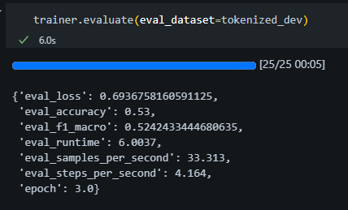
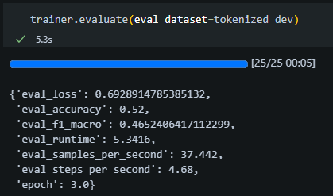
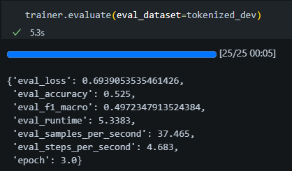
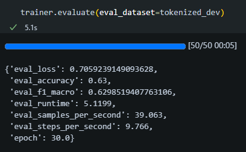

<h3 style="font-size:30px; text-align: center;">Futási eredmények</h3>

bert-base-uncased

**Modell:** `bert-base-uncased`  
**Paraméterek:**
- **Tanulási ráta:** `2e-5`
- **Batch méret:** `8`
- **Epochok száma:** `3`

### Eredmények

| **Metrika**     | **Érték** |
|-----------------|-----------|
| Pontosság       | 0.53      |
| F1-macro        | 0.52      |
| Veszteség       | 0.69      |
| Epoch           | 3         |

- **Futtatási idő:** `6.00 mp`
- **Minták/másodperc:** `33.31`
- **Lépések/másodperc:** `4.16`

### Megjegyzések

- Erőssen inkonzisztens telyesítményt produkált

emilyalsentzer/Bio_ClinicalBERT

**Modell:** `emilyalsentzer/Bio_ClinicalBERT`  
**Paraméterek:**
- **Tanulási ráta:** `2e-5`
- **Batch méret:** `8`
- **Epochok száma:** `3`

### Eredmények

| **Metrika**     | **Érték** |
|-----------------|-----------|
| Pontosság       | 0.52      |
| F1-macro        | 0.47      |
| Veszteség       | 0.69      |
| Epoch           | 3         |

- **Futtatási idő:** `5.34 mp`
- **Minták/másodperc:** `37.44`
- **Lépések/másodperc:** `4.68`

### Megjegyzések

- ...

dmis-lab/biobert-base-cased-v1.1

**Modell:** `dmis-lab/biobert-base-cased-v1.1`  
**Paraméterek:**
- **Tanulási ráta:** `2e-5`
- **Batch méret:** `8`
- **Epochok száma:** `3`

### Eredmények

| **Metrika**     | **Érték** |
|-----------------|-----------|
| Pontosság       | 0.53      |
| F1-macro        | 0.50      |
| Veszteség       | 0.69      |
| Epoch           | 3         |

- **Futtatási idő:** `5.34 mp`
- **Minták/másodperc:** `37.47`
- **Lépések/másodperc:** `4.68`

### Megjegyzések

- ...

bert-base-uncased

**Modell:** `bert-base-uncased`  
**Paraméterek:**
- **Tanulási ráta:** `3e-5`
- **Batch méret:** `8`
- **Epochok száma:** `10`

### Eredmények

| **Metrika**     | **Érték** |
|-----------------|-----------|
| Pontosság       | 0.58      |
| F1-macro        | 0.56      |
| Veszteség       | 0.67      |
| Epoch           | 10        |

- **Futtatási idő:** `5.34 mp`
- **Minták/másodperc:** `37.44`
- **Lépések/másodperc:** `4.68`

### Megjegyzések

- ...

bert-base-uncased

**Modell:** `bert-base-uncased`  
**Paraméterek:**
- **Tanulási ráta:** `5e-6`
- **Batch méret:** `4`
- **Epochok száma:** `30`

### Eredmények

| **Metrika**     | **Érték** |
|-----------------|-----------|
| Pontosság       | 0.63      |
| F1-macro        | 0.63      |
| Veszteség       | 0.71      |
| Epoch           | 30        |

- **Futtatási idő:** `5.12 mp`
- **Minták/másodperc:** `39.06`
- **Lépések/másodperc:** `9.77`

### Megjegyzések

- A 15. epoch után már nem fejlődött a modell

