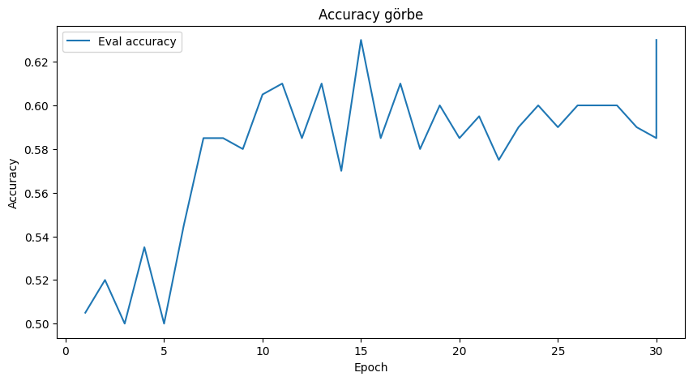

<h3 style="font-size:30px; text-align: center;">Futási eredmények</h3>

bert-base-uncased

**Modell:** `bert-base-uncased`  
**Paraméterek:**
- **Tanulási ráta:** `2e-5`
- **Batch méret:** `8`
- **Epochok száma:** `3`
- **Weight decay:** `0.01`

  

### Eredmények

| **Metrika**     | **Érték** |
|-----------------|-----------|
| Pontosság       | 0.53      |
| F1-macro        | 0.52      |
| Veszteség       | 0.69      |
| Epoch           | 3         |

- **Futtatási idő:** `6.00 mp`  
- **Minták/másodperc:** `33.31`  
- **Lépések/másodperc:** `4.16`

### Megjegyzések

- Erőssen inkonzisztens telyesítményt produkált

  

  

emilyalsentzer/Bio_ClinicalBERT

**Modell:** `emilyalsentzer/Bio_ClinicalBERT`  
**Paraméterek:**
- **Tanulási ráta:** `2e-5`
- **Batch méret:** `8`
- **Epochok száma:** `3`
- **Weight decay:** `0.01`

  

### Eredmények

| **Metrika**     | **Érték** |
|-----------------|-----------|
| Pontosság       | 0.52      |
| F1-macro        | 0.47      |
| Veszteség       | 0.69      |
| Epoch           | 3         |

- **Futtatási idő:** `5.34 mp`  
- **Minták/másodperc:** `37.44`  
- **Lépések/másodperc:** `4.68`

### Megjegyzések

- ...

  

  

dmis-lab/biobert-base-cased-v1.1

**Modell:** `dmis-lab/biobert-base-cased-v1.1`  
**Paraméterek:**
- **Tanulási ráta:** `2e-5`
- **Batch méret:** `8`
- **Epochok száma:** `3`
- **Weight decay:** `0.01`

  

### Eredmények

| **Metrika**     | **Érték** |
|-----------------|-----------|
| Pontosság       | 0.53      |
| F1-macro        | 0.50      |
| Veszteség       | 0.69      |
| Epoch           | 3         |

- **Futtatási idő:** `5.34 mp`  
- **Minták/másodperc:** `37.47`  
- **Lépések/másodperc:** `4.68`

### Megjegyzések

- ...

  

  

bert-base-uncased

**Modell:** `bert-base-uncased`  
**Paraméterek:**
- **Tanulási ráta:** `3e-5`
- **Batch méret:** `8`
- **Epochok száma:** `10`
- **Weight decay:** `0.01`

  

### Eredmények

| **Metrika**     | **Érték** |
|-----------------|-----------|
| Pontosság       | 0.58      |
| F1-macro        | 0.56      |
| Veszteség       | 0.67      |
| Epoch           | 10        |

- **Futtatási idő:** `5.34 mp`  
- **Minták/másodperc:** `37.44`  
- **Lépések/másodperc:** `4.68`

### Megjegyzések

- ...

  

  

bert-base-uncased 30 epoch

**Modell:** `bert-base-uncased`  
**Paraméterek:**
- **Tanulási ráta:** `5e-6`
- **Batch méret:** `4`
- **Epochok száma:** `30`
- **Weight decay:** `0.01`

  

### Eredmények

| **Metrika**     | **Érték** |
|-----------------|-----------|
| Pontosság       | 0.63      |
| F1-macro        | 0.63      |
| Veszteség       | 0.71      |
| Epoch           | 30        |

- **Futtatási idő:** `5.12 mp`  
- **Minták/másodperc:** `39.06`  
- **Lépések/másodperc:** `9.77`

  

  

### Megjegyzések

A fenti eredmények alapján a modell tanul, de a fejlődés korlátozott, és a validációs loss az első ~10 epoch után folyamatosan nő, miközben a training loss tovább csökken. Ez klasszikus **overfitting** jele: a modell egyre jobban megtanulja a tanítóadatokat, de a validációs teljesítménye romlik.

    
    

bert-base-uncased optimalizált paraméterek

**Modell:** `bert-base-uncased`  
**Paraméterek:**
- **Tanulási ráta:** `1e-5`
- **Batch méret:** `8`
- **Epochok száma:** `10`
- **Weight decay:** `0.001`

  

### Eredmények

| **Metrika**     | **Érték** |
|-----------------|-----------|
| Pontosság       | 0.59      |
| F1-macro        | 0.58      |
| Veszteség       | 0.67      |
| Epoch           | 10        |

- **Futtatási idő:** `5.18 mp`  
- **Minták/másodperc:** `38.58`  
- **Lépések/másodperc:** `4.82`

  

  

### Megjegyzések

Ez a futás stabilabb, kevésbé overfitel, és a teljesítménye szinte olyan jó, mint az előzőé.

    
    

emilyalsentzer/Bio_ClinicalBERT optimalizált paraméterek

**Modell:** `emilyalsentzer/Bio_ClinicalBERT`  
**Paraméterek:**
- **Tanulási ráta:** `1e-5`
- **Batch méret:** `8`
- **Epochok száma:** `10`
- **Weight decay:** `0.001`

  

### Eredmények
| **Metrika**     | **Érték** |
|-----------------|-----------|
| Pontosság       | 0.57      |
| F1-macro        | 0.56      |
| Veszteség       | 0.68      |
| Epoch           | 10        |

- **Futtatási idő:** `5.21 mp`  
- **Minták/másodperc:** `38.40`  
- **Lépések/másodperc:** `4.80`

  

  

### Megjegyzések

A mostani futás stabilabb, kevésbé overfitel, és a teljesítménye legalább olyan jó, mint az előzőé.

    
    

